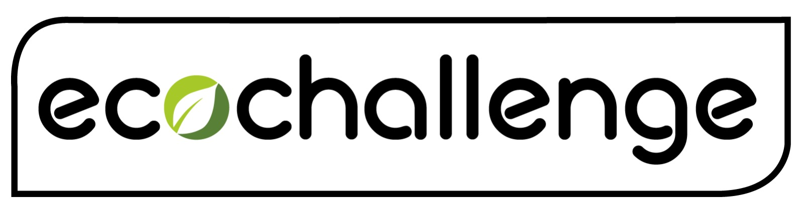
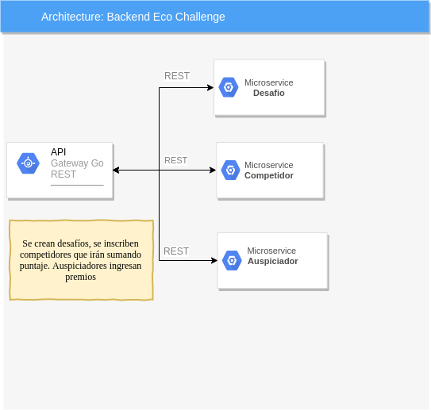

***

Proyecto CC: Proyecto de curso CC asociado a la sustentabilidad ecológica
***
## Descripción del proyecto 
Este proyecto tiene por objetivo incentivar el tipo de vida sustentable con el medio ambiente generando conciencia y acciones pro ecología. Este sistema permitirá a los **organizadores** crear *Desafíos* ecológicos en los cuales de asociarán distintas *metas* las cuales entregarán *puntajes* a los **participantes** que se inscriban en el desafío. Tambien se podrán crear *eventos* en los cuales los usuarios que participen podran sumar puntaje. El sistema tendrá **Auspiciadores** los cuales podrán subir al sistema información asociada a *premios* o *descuentos* a los cuales las personas que cumplan el desafío podrán acceder.

## Alcance
El alcance del proyecto es la construcción del backend del sistema. Para esta versión solo podrá estar activo un desafío en un período de tiempo.

## Arquitectura
La aplicación será desarrollada siguiendo una arquitectura de [microservicios](https://en.wikipedia.org/wiki/Microservices) debido a que a pesar que una solución monolitica sería mas simple de implementar, en el tiempo al requerir escabilidad crecen funcionalidad se vuelven complejas de mantener y desplegar. Las arquitecturas basadas en microservicios permiten un crecimiento escalable simple y logicamente aislado. Las peticiones de información o de ingreso de esta serán recibidas por un API Gateway. Dicho Gateway enrutará las peticiones al microservicio que corresponda. 
Se construirán los siguientes microservicios:
1. Desafíos: Entidad que representa el desafío
2. Competidores: Entidad que representa a los usuarios que participan en el desafío
4. Auspiciadores: Entidad de representa a los auspiciadores que entregarán premios en en desafío

## Herraminetas
* **Lenguajes:** Los microservicios están construidos en Python3 virtualenv como entorno virtual para el desarollo local de los microservicios. Las APIs REST se construirán usarndo Flask. Este microframework es ligero y de facil uso. Ademas cuenta con gran cantidad de material de apoyo existente en la red.
* **Base de datos:** Se hace uso de una base de datos NoSQL [MongoDB](https://www.mongodb.com) para el almacenamiento información. Para la utilización de la BD en python se usa [pymongo](https://api.mongodb.com/python/current/).
* **Comunicación:** Para la comunicación de los microservicios se usará el broker [RabbitMQ](https://www.rabbitmq.com/).
* **Test:** Se realizar un desarrollo basado en pruebas con Unittest para Python. Además en cada actualización del repositorio de Github se ejecutan los tests de Unittest.
* **Servicios:** Cada microservicio generará log, para esto se usará logging y syslog para centralizar la información.

## Historias de usuario
Las historias de usuario que representan los requisitos de este proyecto son las siguientes agrupados por microservicio:
[Microservicio Desafío](https://github.com/rodrigo-orellana/eco-challenge/milestone/7)
[MongMicroservicio CompetidoroDB](https://github.com/rodrigo-orellana/eco-challenge/milestone/6)

## Integración continua

## Despliegue

Despliegue: https://pruebacc.herokuapp.com/

El despliegue del servicio web se realiza en Heroku, que nos ofrece una plataforma como un servicio (PaaS) en la nube. Esto nos permite tener a nuestra disposición un servidor en el que poder desplegar nuestro proyecto en la nube de forma gratuita.

