***
  
Proyecto CC: Proyecto de curso CC asociado a la sustentabilidad ecológica
***
## Descripción del proyecto 
Este proyecto tiene por objetivo incentivar el tipo de vida sustentable con el medio ambiente generando conciencia y acciones pro ecología. Este sistema permitirá a los **organizadores** crear *Desafíos* ecológicos en los cuales de asociarán distintas *metas* las cuales entregarán *puntajes* a los **competidores** que se inscriban en el desafío. Tambien se podrán crear *eventos* en los cuales los usuarios que participen podran sumar puntaje. El sistema tendrá **Auspiciadores** los cuales podrán subir al sistema información asociada a *premios* o *descuentos* a los cuales las personas que cumplan el desafío podrán acceder.  

La documentación del proyecto se encuentra en el siguiente link:
* [Documentación](https://github.com/rodrigo-orellana/eco-challenge/blob/master/docs/indice.md)  

## Provisionamiento de máquinas virtuales  
En una máquina virtual se desplegarón los microservicios desafios y competidor los cuales utilizan internamente en el servidor los puertos 8989 y 8988 respectivamente. por otro lado se habilitó un servicio gateway (proxy inverso) con NGINX el cual recibe peticiones desde internet por el puerto 80 y redirecciona al microservicio que corresponda la ejecucción segun su [configuración](https://github.com/rodrigo-orellana/eco-challenge/blob/master/src/gateway_nginx/nginx.conf)

Se realiza la provisión de máquinas virtuales en la nube, utilizando Google Cloud Plataform. por motivos educacionales de decide implementar la siguiente estrategia utilizando tanto Vagrant como Ansible, así aprender ambos. Ademas se prueba instalando algunos software y librerías con shell script unix desde vagrant para mostrar dicha funcionalidad. Tambien se mostrará los comandos que ofrece gcloud en donde se pueden ejecutar lineas de comando remotas para administrar la MV.

1. Crear maquina virtual utilizando Vagrant y el plugin [Vagrant Google Compute Engine (GCE) Provider](https://www.rubydoc.info/gems/vagrant-google/0.2.3)  
2. Sincronizar directorio de codigos fuentes desde la maquina local a la virtual con Vagrant  
3. Instalar VIRTUALENV Python3 y paquetes requeridos con Vagrant   
4. Creación reglas de firewall en GCP utilizando la herramienta de línea de comandos de gcloud compute. Se abre puerto 80  
5. Instalación de Nginx con Ansible y instalación archivo de configuración como gateway  
6. Habilita puerto 80 en MV con Ansible  
7. Inicia nginx  con Ansible  
8. Instala e inicia mongodb  con Ansible  

En los siguientes puntos se detallará cada punto  

**1. Creación de Máquina Virtual**  
Para la creación de la maquina virtual se procede con la instalación en la maquina local del:  
*Virtual Box*  
*Vagrant*  
*plugin GCE* [Vagrant Google Compute Engine (GCE) Provider](https://www.rubydoc.info/gems/vagrant-google/0.2.3)  
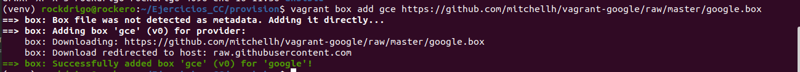

Vagran es una herramienta que permite a traves de script crear infraestructura virtual y maquinas virtuales a partir de imagenes previamente creadas. Al utilizarlo con el plugin de GCE se lográ integrar con esta plataforma en la nube. el puglin permite el manejo de funcionalidad de configuración de la nueva máquina virtual, como la ubicación, nombre, la capacidad deinfraestructura (tipo de maquina). La conexión se establece creando una cuenta "service account" en el sitio web de GCP y descargando un archivo json de autenticación y posterior configuración de relación de confianza SSH.
Se creó el siguiente archivo *Vagrantfile* el cual está comentado para su correcta documentación

~~~
Vagrant.configure("2") do |config|
  # usamos RSync para sincronizar el directorio del proyecto en cada vagrant up o vagrant reload
  # hacemos uso de esta funcionalidad para subir simplemente los fuentes
  config.vm.synced_folder "~/eco-challenge/src", "/vagrant", type: "rsync"
  # podriamos excluir algun directorio o fichero con la siguiente configuración:
  # , rsync__exclude: ".git/"
  # utilizaremos el box GCE Google Compute Engine.
  config.vm.box = "gce"
  # ejecuta shell con script de instalación
  config.vm.provision :shell, :path => "deploy/install_python.sh"
  # opciones de configuracion propias de GCP
  config.vm.provider :google do |google, override|
    # Identificación del proyecto creado en GCP al que se le asociará la MV
    google.google_project_id = "my-project-1576105871255"
    # Datos del service account. no requeridos al utilizar relación de confianza ssh
    # google.google_client_email = "admin-gcp@my-project-1576105871255.iam.gserviceaccount.com"
    # Clave json de service account descargada de GCP
    google.google_json_key_location = "/home/rockdrigo/Ejercicios_CC/provision/my-project-1576105871255-494ced92f000.json"
    # Nonmbre de la instancia a crear
    google.name = "mv-rodrigo"
    # zona de la instancia (datacenter).
    google.zone = "us-central1-c"
    # Tipo de maquina:n1-standard-2	2CPU	7.5GB RAM
    google.machine_type = "n1-standard-2"
    # Imagen a utilizar para la creación de la MV
    google.image = "ubuntu-1804-bionic-v20200108"	
    # credenciales SSH: usuario SSH creado en pasos anteriores
    override.ssh.username = "admin-gcp"
    # credenciales SSH: ruta fichero clave privada asociada al usuario
    override.ssh.private_key_path = "~/.ssh/admin-gcp"
  end
end
~~~

**2. Sincronizar directorio**  
Vagrant permite realizar la sincronización de un directorio, en el cual todo el contenido del directorio origen es copiado en la MV.
~~~
  config.vm.synced_folder "~/eco-challenge/src", "/vagrant", type: "rsync"
  # podriamos excluir algun directorio o fichero con la siguiente configuración:
  # , rsync__exclude: ".git/"
~~~
De esta forma se le entregan los fuentes a la maquina nueva.   

**3. Instalar VIRTUALENV Python3**  
Ademas de crear la MV, vagrant permite ejecutar [shell script unix](https://github.com/rodrigo-orellana/eco-challenge/blob/master/deploy/install_python.sh)   en el servidor destino. El [shell script unix](https://github.com/rodrigo-orellana/eco-challenge/blob/master/deploy/install_python.sh) desarrollado tiene por objetivo ejecutar instrucción de sistema con tal de instalar pip3, VIRTUALENV y otras librerías python3 requeridas por los microservicios. Ademas setea una variable de ambiente requerida, que indica que la base de datos mongodb de ejecutará localmente.  

Se optó por configurar una MV con bajos recursos de hardware, la cual se medirá sus prestaciones, en caso de que se requiera ampliar, se creará una nueva MV.
~~~
# Tipo de maquina:n1-standard-2	2CPU	7.50GB RAM
  google.machine_type = "n1-standard-2"
~~~
Se optó por un sistema operativo conocido por el autor de este trabajo, esto facilitará resolver cualquier issue que pueda surgir. Estas imagenes se deben elegir dentro de un listado proporcionado por GCP en su sitio web.  
[infraestructura GCP](https://cloud.google.com/compute/docs/machine-types?hl=es-419)  
[zonas](https://cloud.google.com/compute/docs/regions-zones/?hl=es-419)  

~~~
# Imagen a utilizar para la creación de la MV
  google.image = "ubuntu-1804-bionic-v20200108"
~~~
La ejecución de vagrant se realiza con el siguiente comando
~~~
vagrant up --provider=google
~~~
Para chequear  el estatus
~~~
vagrant status
~~~
La reejecución utiliza el siguiente comando, en donde pasamos por parametro el id de MV retornado del comando anterior
~~~
vagrant reload --provision ceaba7f
~~~
 Destruye la máquina virtual y todo su contenido:
~~~
 vagrant destroy
~~~

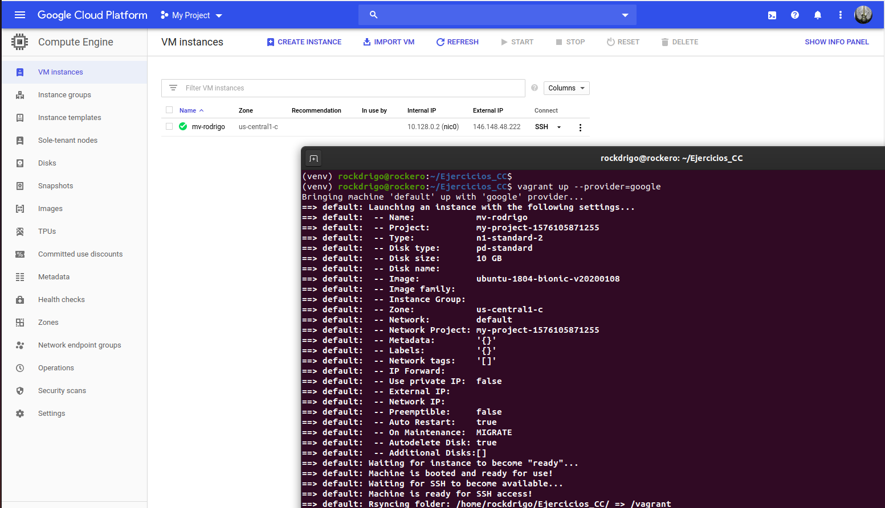

‘vagrant destroy’: Destruye la máquina virtual y todo su contenido.
**4. Creación reglas de firewall en GCP**  
Se añade la siguiente regla de firewall por linea de comando, la cual permite conexiones al puerto 80 del servicio nginx en GCP
~~~
gcloud compute firewall-rules create default-allow-http \
    --network default \
    --action allow \
    --direction ingress \
    --rules tcp:80 \
    --priority 1000 \
    --source-ranges 0.0.0.0/0
~~~
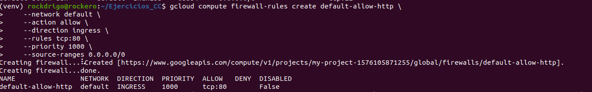
en donde de indica creación (create) de reglas de firewall (firewall-rules),  y el nombre que le asignaremos a la regla (default-allow-http), el resto de las línes significan lo siguiente:  
~~~
    --network default: aplica a la red por default del proyecto GCP
    --action allow: es una regla de habilitación
    --direction ingress: para peticiones de entrada
    --rules tcp:80: peticiones al puerto 80 de protocolo tcp
    --priority 1000: prioridad en relación a otras reglas existentes. se le dió la mas baja.
    --source-ranges 0.0.0.0/0:  con esta configuración de indicamos que las peticiones pueden tener cualquier IP origen
~~~

**5. Instalación de Nginx con Ansible**  
Ansible es una potente y popular herramienta que permite administrar o crear maquinas de manera remota, sin necesidad de contar con un software adicional en el servidor destino. Posee acceso ssh a host administrados. Utiliza playbooks (ficheros en YAML ) donde de indica la máquina destino qué es lo que hay que instalar en tareas o tasks. primero se debe crear un [inventario](https://github.com/rodrigo-orellana/eco-challenge/blob/master/deploy/ansible_hosts) de los servidores a utilizar, en mi caso solo será uno, indicamos la IP externa entregada por GCP de nuestra MV:
~~~
[vagrantboxes]
35.239.143.67
~~~
Luego creamos un archivo [playbooks](https://github.com/rodrigo-orellana/eco-challenge/blob/master/deploy/basico.yaml) que comentaremos indicando  sus acciones
~~~
---
- hosts: all  # configuraciones a aplicar en todos los nodos del inventario
  become: yes #  escalamiento de permisos de ejecucción root
  tasks: # tareas a ejecutar
    - name: Installs nginx web server 
      # update_cache=true similar a apt-get update, which downloads the latest package lists from the Ubuntu repositories
      apt: pkg=nginx state=present update_cache=true #invoca el comando apt, indicándole que el paquete nginx tiene que estar presente
    - name: instala archivo conf de nginx y omite el resultado
      # el archivo nginx.conf fue subido en el syncro de vagrand
      shell: cp /vagrant/gateway_nginx/nginx.conf /etc/nginx/nginx.conf || /bin/true 
    - name: habilita puerto 80 para nginx
      shell: ufw allow 'Nginx HTTP'
      notify:
        - start nginx
    - name: Instalación mongodb # paso 1 key repo mongodb
      apt_key:
        keyserver: hkp://keyserver.ubuntu.com:80
        id: 9DA31620334BD75D9DCB49F368818C72E52529D4
    - name: install mongodb #latest solo descarga actualizaciones del tipo bugfix related. 
      apt: pkg=mongodb state=latest update_cache=yes
      notify: # invoca al triger mongodb
      - start mongodb
    - name: Ejecuta aplicación web microservicio desafios # nohup para ejecutar en segundo plano. no espera argumento y descarta la salida
      shell: "start-stop-daemon --start --quiet --pidfile /var/run/test --exec /vagrant/start_desafios.sh"
    - name: Ejecuta aplicación web microservicio competidor
      shell: "start-stop-daemon --start --quiet --pidfile /var/run/test --exec /vagrant/start_competidor.sh"
    
  handlers:
    - name: start nginx #inicia servicio nginx
      service: name=nginx state=started
    - name: start mongodb #inicia la bd
      service: name=mongodb state=started
~~~
Para levantar los servicios en el archivo se ven las siguientes lines de comando:
~~~
shell: "start-stop-daemon --start --quiet --pidfile /var/run/test --exec /vagrant/start_desafios.sh"
~~~
esto levanta el proceso como demonio
~~~
--start: inicia servicio
--quiet: descarta mensajes, excepto de error
--pidfile: chequea si el proceso ya tiene un archivo pid-file
--exec shell a ejecutar
~~~

Las shell que se llaman para iniciar el servicio son las siguientes:
* [start_desafios.sh](https://github.com/rodrigo-orellana/eco-challenge/blob/master/src/start_desafios.sh)  
* [start_competidor.sh](https://github.com/rodrigo-orellana/eco-challenge/blob/master/src/start_desafios.sh)  
Estas shell tienen el siguiente contenido:
~~~
#!/bin/bash
source /home/vagrant/env/bin/activate; nohup python3 /vagrant/desafios/sanic_rest.py </dev/null >/dev/null 2>&1 & sleep 1
~~~
source para usar el python3 de venv, nohup para ejecutar en segundo plano. no espera argumento y descarta la salida. Sleep 1 para devolver el pront.  

La ejecución la realizamos con el siguiente comando, donde le indicamos el usuario de la MV y el nombre del fichero yaml con las instrucciones
~~~
ansible-playbook -u admin-gcp basico.yaml
~~~
donde -u indica el usuario creado en GCP
**Pruebas de prestaciones**  
Creamos el siguiente archivo de taurus para medir las prestaciones el cual lo subimos a la MV.
~~~
execution:
    # usuarios simulados  
    - concurrency: 10
        # Tiempo en que se crearán los 10 usuarios
      ramp-up: 5s
        # Tiempo en el cual se mantendrá la carga
      hold-for: 20s
        # nombre del escenario
      scenario: mv

scenarios:
    mv:
        requests:        
        #  Ruta de la app
        - url: http://localhost/desafios/1
        #  indicamos el metodo
          method: GET
        # ejecutar GET 
        - url:  http://localhost/competidor/rodrigo
          method: GET
        # ejecutar get otra ruta
        - url:  http://localhost/desafios/2
          method: GET
~~~

Entramos a la MV con el comando:
~~~
vagrant ssh
~~~
Ejecutamos el script con taurus y obtenemos los siguientes resultados:
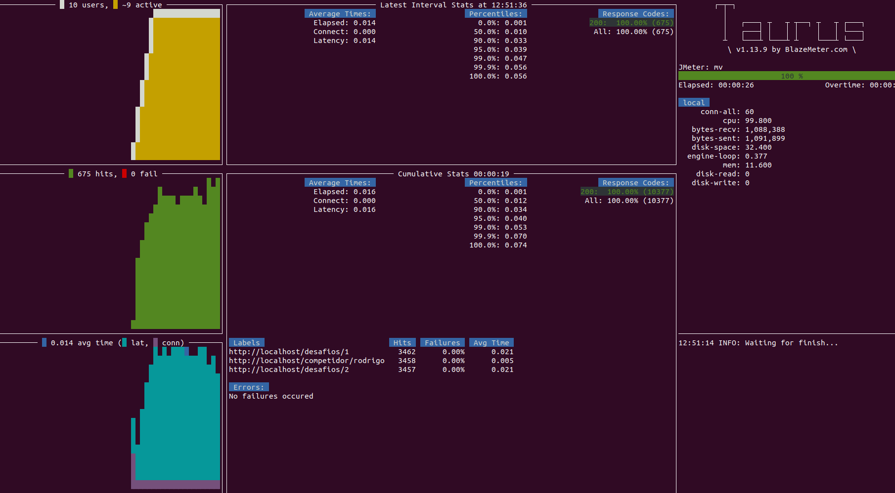

Como se observa, la maquina no alcanza las 1000 peticiones por segundo, esta cerca de la mitad de este valor, por lo cual aumentaremos el procesador a uno del doble de su capacidad actual, el cual sería el siguiente:
n1-standard-4: 4 CPU, 15GB RAM, 
por lo que el archivo Vagrantfile quedaría así:

~~~
Vagrant.configure("2") do |config|
  # usamos RSync para sincronizar el directorio del proyecto en cada vagrant up o vagrant reload
  # hacemos uso de esta funcionalidad para subir simplemente los fuentes
  config.vm.synced_folder "~/eco-challenge/src", "/vagrant", type: "rsync"
  # podriamos excluir algun directorio o fichero con la siguiente configuración:
  # , rsync__exclude: ".git/"
  # utilizaremos el box GCE Google Compute Engine.
  config.vm.box = "gce"
  # ejecuta shell con script de instalación
  config.vm.provision :shell, :path => "deploy/install_python.sh"
  # opciones de configuracion propias de GCP
  config.vm.provider :google do |google, override|
    # Identificación del proyecto creado en GCP al que se le asociará la MV
    google.google_project_id = "my-project-1576105871255"
    # Datos del service account. no requeridos al utilizar relación de confianza ssh
    # google.google_client_email = "admin-gcp@my-project-1576105871255.iam.gserviceaccount.com"
    # Clave json de service account descargada de GCP
    google.google_json_key_location = "/home/rockdrigo/Ejercicios_CC/provision/my-project-1576105871255-494ced92f000.json"
    # Nonmbre de la instancia a crear
    google.name = "mv-rodrigo"
    # zona de la instancia (datacenter).
    google.zone = "us-central1-c"
    # Tipo de maquina:n1-standard-4	4CPU	15GB RAM
    google.machine_type = "n1-standard-4"
    # Imagen a utilizar para la creación de la MV
    google.image = "ubuntu-1804-bionic-v20200108"	
    # credenciales SSH: usuario SSH creado en pasos anteriores
    override.ssh.username = "admin-gcp"
    # credenciales SSH: ruta fichero clave privada asociada al usuario
    override.ssh.private_key_path = "~/.ssh/admin-gcp"
  end
end
~~~
Para aplicar tambien se puede realizar via comando shell
~~~
# detenemos la instancia
gcloud compute instances stop mv-rodrigo
# modificamos la capacidad de la maquina a n1-standard-4
gcloud compute instances set-machine-type mv-rodrigo --machine-type n1-standard-4
# iniciamos la instancia
gcloud compute instances start mv-rodrigo
~~~
donde mv-rodrigo	es el nombre de la instancia

Se ejecuta nuevamente el script de ansible
~~~
ansible-playbook -u admin-gcp basico.yaml
~~~

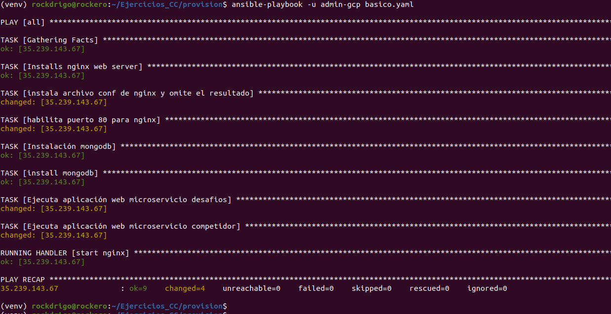  

Al probar las prestaciones, vemos que aumentaron y ya superan las 1000 hit por segundo
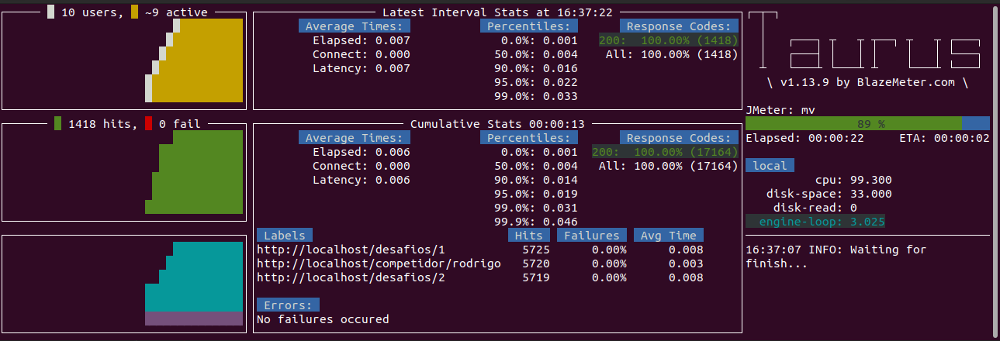  

La configuración esta hecha para trabajar con 4 workers tanto en sanic de cada servicio como en nginx debido a las 4 CPU disponibles.  

Como se observa, ya se superan los 1000 hits por segundo requeridos, notese que estas pruebas se realizaron sobre el gateway nginx el cual invoca a cada microservicio segun corresponda. Ambos microservicios utilizan la base local mongodb de la MV.

**Evidencias con postman**
Se realizan las siguientes pruebas con postman
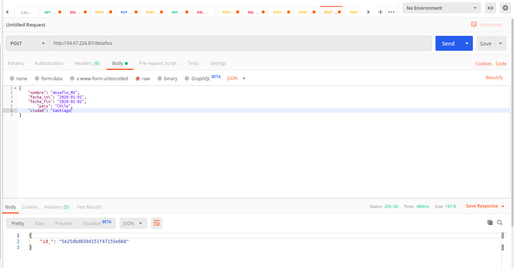   

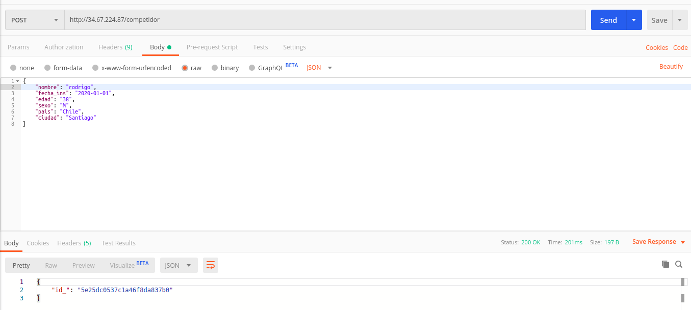   

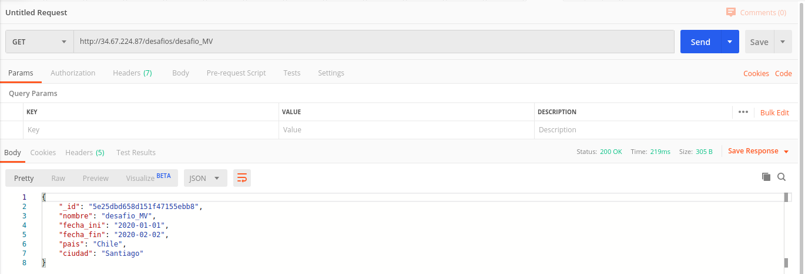   

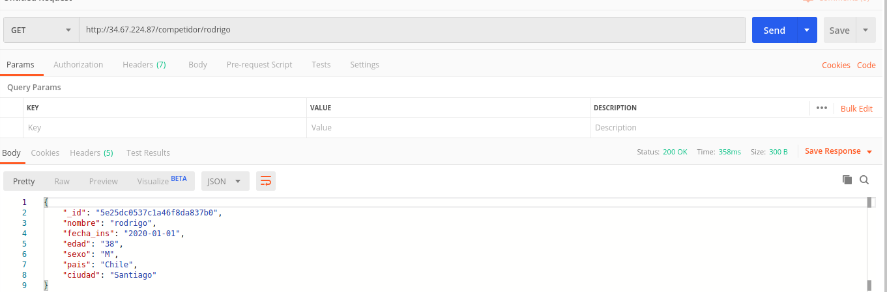  

Y la maquina creada en GCP
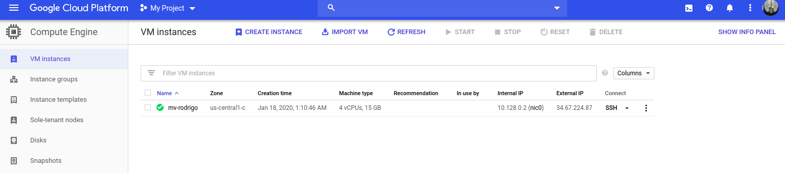  

**Rutas Anteriores**  
buildtool: Makefile  
Contenedor: https://github.com/rodrigo-orellana/eco-challenge/packages/66342  
[Documentación](https://github.com/rodrigo-orellana/eco-challenge/blob/master/docs/indice.md)  