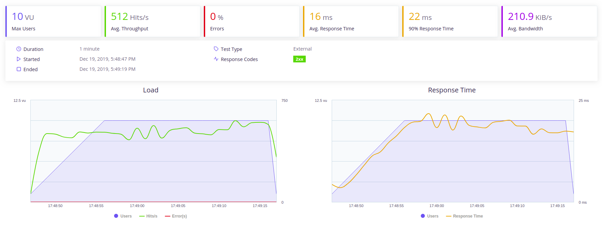
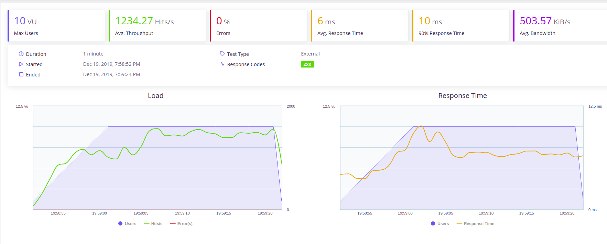

***
  
Proyecto CC: Proyecto de curso CC asociado a la sustentabilidad ecológica
***
## Descripción del proyecto 
Este proyecto tiene por objetivo incentivar el tipo de vida sustentable con el medio ambiente generando conciencia y acciones pro ecología. Este sistema permitirá a los **organizadores** crear *Desafíos* ecológicos en los cuales de asociarán distintas *metas* las cuales entregarán *puntajes* a los **participantes** que se inscriban en el desafío. Tambien se podrán crear *eventos* en los cuales los usuarios que participen podran sumar puntaje. El sistema tendrá **Auspiciadores** los cuales podrán subir al sistema información asociada a *premios* o *descuentos* a los cuales las personas que cumplan el desafío podrán acceder.  

La documentación del proyecto se encuentra en el siguiente link:
* [Documentación](https://github.com/rodrigo-orellana/eco-challenge/blob/master/docs/indice.md)  

## Medición de prestaciones 
~~~
Prestaciones:medicion.yml
~~~  
Se realiza una medición de prestaciones (SLA), que consiste en medir la carga que soportan los micorservicios. En la creación de un microservicio se debe definir la cantidad de concurrencia que este debe soportar. El requierimiento para este proyecto es que el microservicio poseea un nivel de prestaciones minimo de 1000 peticiones para 10 usuarios concurrentes por un tiempo minimo de 10 segundos a distintas url (get, post, delete)

...
**Herramienta**  
Se opta por la herramienta recomendada en el curso: [Taurus](http://gettaurus.org/) la cual es una extensión de Jmeter de Apache. Esta herramienta permite llevar a cabo peticiones para medir las prestaciones concurrentes a un microservicio. Taurus posee un front-end que con informes detallados sobre los resultados de las peticiones. Se realizan peticiones base sobre un solo servicio, y luego peticiones concurrentes, a la vez, varias peticiones. En general, un solo servicio se degradará cuando se comiencen a hacer varias peticiones concurrentes. Taurus utiliza un archivo de configuración YAML que  es un formato de serialización de datos legible por humanos inspirado en lenguajes como XML, C, Python, Perl. El siguiente es el [archivo de medición](https://github.com/rodrigo-orellana/eco-challenge/blob/master/medicion_multi.yml).  

~~~  
execution:
  # usuarios simulados  
- concurrency: 10
  # Tiempo en que se crearán los 10 usuarios
  ramp-up: 10s
  # Tiempo en el cual se mantendrá la carga
  hold-for: 20s
  # nombre del escenario
  scenario: cc_hito_4

scenarios:
  cc_hito_4:
    # tiempo maximo para conectar y recibir respuesta
    timeout: 5s 
    # para que no recupere todos los recursos incrustados de páginas HTML
    retrieve-resources: false
    # no guardar cache
    store-cache: false
    # no guardar cookies
    store-cookie: false
    # URL base de las pruebas
    default-address: http://localhost:8000
    headers:
      #definimos el header del cliente de simulación
      User-Agent: 'Mozilla/5.0 (X11; Linux x86_64) AppleWebKit/537.36 (KHTML, like Gecko) Chrome/77.0.3865.90 Safari/537.36'
      Accept-Language: 'en-US,en;q=0.8'
      Accept-Encoding: 'gzip, deflate'
      Accept: 'text/html,application/xhtml+xml,application/xml;q=0.9,image/webp'
    requests:
    # Ruta de la app
    - /desafios
    - url: '/desafios'
      method: POST
      headers:
        Content-Type: application/x-www-form-urlencoded
      body:
        nombre: test0007
    - url: '/desafios/test0007'
      method: GET
    - url: '/desafios/test0007'
      method: DELETE
      headers:
        Content-Type: application/x-www-form-urlencoded
      body:
        nombre: test0007
~~~  

**Estrategia**  
El objetivo es medir las prestaciones del servicio, por lo que las pruebas se realizan en local para aislar de la medición las latencias de la red, más aun considerando que el microservicio que está desplegado en Heroku utiliza una BD que está en la nube en distintos sitios (mongoDB). Las pruebas se realizan en local con una mongoDB local tambien.  Considerar en los resultados que el servicio fué probado en una maquina portatil de prestaciones de escritorio, con procesado intel i5 de octava generación. Se realiazań pruebas conjuntas de GET, POST y DELETE.  
***Nota importante:*** No se realizaron pruebas en los ambientes desplegados, debido a que se han utilizado cuentas gratuitas de MongoDB y Heroku. En una situación real de puesta a producción si se haría esencial apuntar las pruebas ahí y tener requisitos tales de la red entre la BD y el servidor en cuando a la velocidad de comunicación o buscar una solución embebida que sería la zona critica a resolver. Dado esto se enfocan los test a la implementación del servicio y sus configuraciones de ejecución  
  
**Situación Inicial**  
Las primeras mediciones se realizan sobre el microservicio en su situación actual. se levanta el servicio:  
~~~  
gunicorn principal:app
~~~  
Luego se ejecutan los test
~~~  
bzt medicion_multi.yml -report
~~~  
Se obtienen los siguientes resultados:  
  
La grafica muestra como se comporta el microservicio al recibir peticiones de los 10 usuarios, logrando responder a una velocidad promedio de 512 peticiones por segundo, no presentando errores en ese nivel. El tiempo promedio de respuesta fué de 16 ms, y de estas el 90% se respondieron en 22 ms. Se mantuvo la carga total de usuarios por 10s.  

**Mejora de ejecucción**  
Para mejorar la cantidad de peticiones a las que puede contestar el servicio, se utiliza algúnos parameros en el comando de unicorn como se muestra en la siguiente línea:  
~~~  
gunicorn --workers=5 principal:app
~~~  
Segun se indica en la documentación de gunicorn, con el parametro "workers" permite levantar la aplicación web con más capacidad para responder de manera concurrente, segun el número indicado y limitado a la cantidad de cores que posea el procesado (considerar otros procesos que convivan en el servidor). En mi caso de probó con distintos valores, encontrando que con 5 workers (el amiente local posee 6 cores, al restarle 1 a este número obtenemos 5) la aplicación mejora segun se muestra en la siguiente imagen  
  
La grafica muestra como se comporta el microservicio al recibir peticiones de los 10 usuarios, logrando responder a una velocidad promedio de 1234 peticiones por segundo (más del doble de lo que permitía la situación inicial), no presentando errores en ese nivel. El tiempo promedio de respuesta fué de 6 ms, y de estas el 90% se respondieron en 10 ms. Se mantuvo la carga total de usuarios por 10s.  Con esta configuración se cumple el requisito del curso de que el microservicio poseea un nivel de prestaciones minimo de 1000 peticiones para 10 usuarios concurrentes por un tiempo minimo de 10 segundos a distintas url (get, post, delete).  
Otras tecnicas para mejorar las prestaciones de un microservicio vienen asociadas a almacenar cache de peticiones anteriores, en este caso no fue necesario para alcanzar el requisito, aun que Python permite con [Flask-Cache](https://pythonhosted.org/Flask-Cache/)  agregar esta caracteristica.  

buildtool: Makefile  