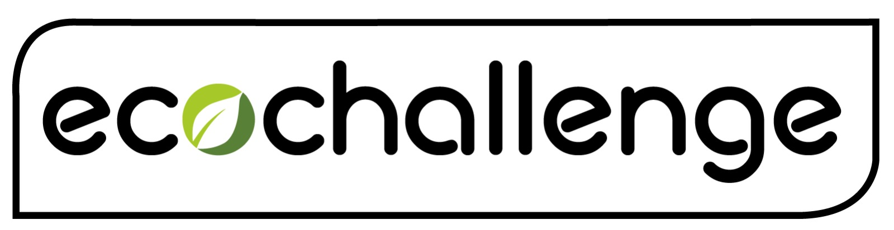

***
Proyecto CC: Proyecto de curso CC asociado a la sustentabilidad ecológica
***
## Descripción del proyecto 
Este proyecto tiene por objetivo incentivar el tipo de vida sustentable con el medio ambiente generando conciencia y acciones pro ecología. Este sistema permitirá a los **organizadores** crear *Desafíos* ecológicos en los cuales de asociarán distintas *metas* las cuales entregarán *puntajes* a los **participantes** que se inscriban en el desafío. Tambien se podrán crear *eventos* en los cuales los usuarios que participen podran sumar puntaje. El sistema tendrá **Auspiciadores** los cuales podrán subir al sistema información asociada a *premios* o *descuentos* a los cuales las personas que cumplan el desafío podrán acceder.

## Arquitectura
La aplicación será desarrollada siguiendo una arquitectura de [microservicios](https://en.wikipedia.org/wiki/Microservices) 
Puedes ver la [documentación](https://github.com/rodrigo-orellana/eco-challenge/blob/master/docs/arquitectura.md) para más información

## Herraminetas
El desarrollo del proyecto utiliza Python3 venv con microframework Flask para la interfaz REST, base de datos NoSQL [MongoDB](https://www.mongodb.com). Para la utilización de la BD en python se usa [pymongo](https://api.mongodb.com/python/current/). 

Más información sobre lenguajes y tecnologías usadas en la [documentación](https://github.com/rodrigo-orellana/eco-challenge/blob/master/docs/herramientas.md)  

## Historias de usuario
Las historias de usuario que representan los requisitos de este proyecto son las siguientes agrupados por microservicio:
* [Microservicio Desafío](https://github.com/rodrigo-orellana/eco-challenge/milestone/7)
* [MongMicroservicio CompetidoroDB](https://github.com/rodrigo-orellana/eco-challenge/milestone/6)

## Integración continua
El objetivo implementa integración continua con Travis-CI y CircleCI . Más información ver la [documentación](https://github.com/rodrigo-orellana/eco-challenge/blob/master/docs/integracion_continua.md)

## Herramienta de construcción
buildtool: Makefile  
Este proyecto implementa un makefile como herramienta builtool, para más información puede consultar la [documentación](https://github.com/rodrigo-orellana/eco-challenge/blob/master/docs/buildtool.md)

## Test 
Para la automatización de los test se utiliza el framework de Python llamdo [Unittest](https://docs.python.org/3/library/unittest.html), para más información puede consultar la [documentación](https://github.com/rodrigo-orellana/eco-challenge/blob/master/docs/test.md)

## Medición presatciones y single source of truth
[documentación](https://github.com/rodrigo-orellana/eco-challenge/blob/master/docs/prestaciones.md)

## Virtualización sobre Docker
El concepto de [Docker](https://www.docker.com/) nace de la intención de poder administrar mejor los recursos de hardware (capacidad de computo), al virtualizar se crean pequeños ordenadores virtuales en los que se  distrubuyen los recursos, ademas de aislar las aplicaciones de otras que estén en el mismo servidor en distintas máquinas virtuales. En el caso de Docker, permite crear ambientes vittuales simplificados de pequeño tamaño, los que luego al desplegarse asegura que las pruebas realizadas en local se comportarán identicamente en el servidor de destino, al poseer una configuración que es exactamente la misma localmente y en la nube.  

Las opciones analizadas  
* **fedora-python:** Esta imagen basada en fedora que incluye python, tiene un peso cercano a lo 400 MB
* **Python:** El Docker oficial de Python, con buena aceptación en la comunidad (tag slim-buster). ofrece la ultima versión de Python. Se probó tambien con tag "3", con un peso final de más  de 900 MB.
* **jfloff/alpine-python** Imágen basada en Alpine, incluye python3-dev. el tag "latest-slim" tiene un peso cercano a 200 MB incluyendo python. Requiere incorporar manualmente la libreria gcc y musl-dev necesario para la instalación. *Esto no significa que la imagen sea mala, lo que ocurre es que está optimizada a tener lo preciso para su ejecución, por lo que para la instalación se puede agregar lo que sea requerido*
* **ubuntu:latest** Imágen basada en ubuntu, tiene un peso cercano a los 500 MB.  

De las opciones analizadas se opta por **ubuntu:latest** debido a que el ambiente de desarrollo es ubuntu, esto nos asegura mayor compatibilidad.  

**Manos a la obra:** seguimos los siguientes pasos para la creación de nuestra imagen Docker de proyecto:  
Instalar Docker cliente -> Descargar Imagen -> Copiar fuentes proyecto ->instalar pip3 -> exponer los puertos -> Hacer ejecutable el Docker -> Crear Imagen Docker del proyecto  
El siguiente es el Dockerfile del proyecto *debidamente comentado*:  
~~~
# Esta es la imagen base del proyecto
FROM ubuntu:latest
LABEL maintainer="rodrigoesteban@correo.ugr.es"
# Indicamos el directorio de trabajo de la imagen:
WORKDIR ~/ecochallenge/

#Copiamos los archivos necesarios para que funcione el servicio web.
COPY ./principal.py  principal.py
COPY ./mongoDB.py  mongoDB.py
COPY ./desafio.py  desafio.py
COPY ./competidor.py  competidor.py
COPY ./requirements.txt requirements.txt

# Actualizamos la imagen, instalamos pip y lo actualizamos
# uso el parametro -y porque la construcción no es interactiva.
RUN apt-get update \
  && apt-get install -y python3-pip \
  && cd /usr/local/bin \
  && ln -s /usr/bin/python3 python \
  && pip3 install --upgrade pip

#Instala dependencias del proyecto
RUN pip install -r requirements.txt

EXPOSE 8989
# Comandos para ejecutar el servicio
# ENTRYPOINT indica que CMD se ejecuta sobre python
ENTRYPOINT ["python3"]
# ejecuta la app --bind para especificar al socket donde va a escuchar: localhost puerto 8989.
CMD gunicorn principal:app --bind 0.0.0.0:8989
~~~

Creamos nuesta imagen:
~~~
docker build -t ecochallenge:3.0 .
~~~
ecochallenge es el nombre de la imagen y el 3.0 es el tag
Luego la ejecutamos
~~~
docker run -it -d -p 8989:8989 ecochallenge
~~~
Nuesta aplicación corre en el puerto 8989, se mapea desde el 8989.
La imagen creada:
~~~
*docker images*
REPOSITORY                TAG                 IMAGE ID            CREATED             SIZE
ecochallenge              3.0                 68980547ff8a        5 minutes ago      499MB

*docker ps*
CONTAINER ID        IMAGE               COMMAND                  CREATED             STATUS              PORTS                    
122d348813d7        ecochallenge        "python3 principal.py"   15 minutes ago      Up 15 minutes       0.0.0.0:8989->8989/tcp   
~~~
Y desplegamos la imagen en hub docker, con *docker login* y luego:
~~~
docker tag 68980547ff8a rodrigoorellana/ecochallenge:3.0
docker push rodrigoorellana/ecochallenge
~~~

Contenedor: https://hub.docker.com/repository/docker/rodrigoorellana/ecochallenge  
  
Y desplegamos la imagen en github con el id de la imagen creando el tag y subiendo con push  
~~~
docker login docker.pkg.github.com -u $USER -p $TOKEN  
docker tag 68980547ff8a docker.pkg.github.com/rodrigo-orellana/eco-challenge/ecochallenge:3.0	
docker push docker.pkg.github.com/rodrigo-orellana/eco-challenge/ecochallenge:3.0  
~~~
Contenedor: https://github.com/rodrigo-orellana/eco-challenge/packages/66342  

## Despliegue
[Despliegue:](https://ecochallenge.herokuapp.com/)  
El despliegue del servicio web se realiza en [Heroku](https://www.heroku.com), que nos ofrece una plataforma como un servicio ([PaaS](https://en.wikipedia.org/wiki/Platform_as_a_service)) en la nube. Esto nos permite tener a nuestra disposición un servidor en el que poder desplegar nuestro proyecto en la nube de forma gratuita, vinculando nuestra cuenta de github permite realizar el despligue de nuestro servicio automaticamente una vez finalizas correctamente nuestro set de pruebas de TRAVIS. Para ello creamos el archivo de creación de nuestro docker de la siguiente forma:  
~~~
build:
  docker:
    # Dockerfile para crear nuevo docker 
    web: Dockerfile
~~~
Ademas seguimos los pasos indicados en la documentación [oficial](https://devcenter.heroku.com/articles/build-docker-images-heroku-yml) 
La prueba del microservicio está disponible desde aquí:
  
https://ecochallenge.herokuapp.com/              -> indica status de la aplicación  
https://ecochallenge.herokuapp.com/desafios      -> lista todos desafios de la BD  
https://ecochallenge.herokuapp.com/desafios/Bike -> Lista un desafio en perticular  

La evidencia de configuración de asociación de cuenta de heroku con github  
  
¿Porque opté por heroku? Vi muchos avisos de trabajo en el cual se requería conocer de este servicio PaaS.  
## Arquitectura en capas de microservicios
La arquitectura de este microservicio está compuesta por tres capas:  

**servicio:** Interfaz de acceso al microservicio: [wsgi.py](https://github.com/rodrigo-orellana/eco-challenge/blob/master/challenge/wsgi.py)  
**negocio:** Ejecuta subrutinas y acciones de los usuarios: [desafio.py](https://github.com/rodrigo-orellana/eco-challenge/blob/master/challenge/desafio.py) [competidor.py](https://github.com/rodrigo-orellana/eco-challenge/blob/master/challenge/competidor.py)  
**BD:** Ejecuta comunicación con BD: [mongoDB.py](https://github.com/rodrigo-orellana/eco-challenge/blob/master/challenge/mongoDB.py)  