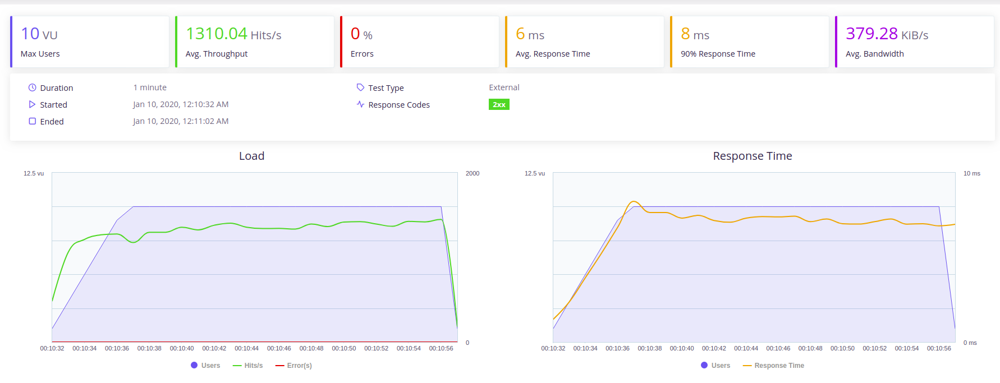
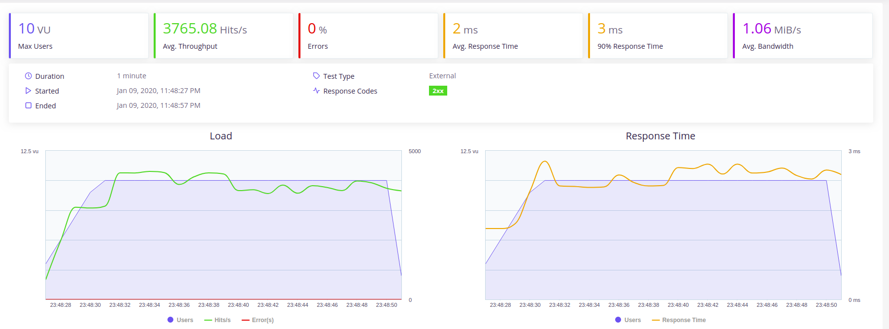
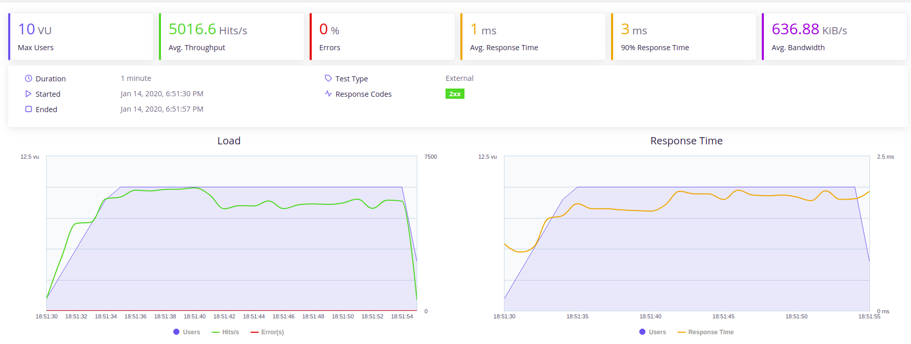

## Medición de prestaciones 
Prestaciones: fichero_de_medicion.yml  
Se realiza una medición de prestaciones (SLA), que consiste en medir la carga que soportan los micorservicios. En la creación de un microservicio se debe definir la cantidad de concurrencia que este debe soportar. El requierimiento para este proyecto es que el microservicio poseea un nivel de prestaciones minimo de 1000 peticiones para 10 usuarios concurrentes por un tiempo minimo de 10 segundos a distintas url (get, post)

...
**Herramienta**  
Se opta por la herramienta recomendada en el curso: [Taurus](http://gettaurus.org/) la cual es una extensión de Jmeter de Apache. Esta herramienta permite llevar a cabo peticiones para medir las prestaciones concurrentes a un microservicio. Taurus posee un front-end que con informes detallados sobre los resultados de las peticiones. Se realizan peticiones base sobre un solo servicio, y luego peticiones concurrentes, a la vez, varias peticiones. En general, un solo servicio se degradará cuando se comiencen a hacer varias peticiones concurrentes. Taurus utiliza un archivo de configuración YAML que  es un formato de serialización de datos legible por humanos inspirado en lenguajes como XML, C, Python, Perl. El siguiente es el [archivo de medición](https://github.com/rodrigo-orellana/eco-challenge/blob/master/fichero_de_medicion.yml).  

~~~  
execution:
    # usuarios simulados  
    - concurrency: 10
        # Tiempo en que se crearán los 10 usuarios
      ramp-up: 5s
        # Tiempo en el cual se mantendrá la carga
      hold-for: 20s
        # nombre del escenario
      scenario: cc_hit0_4

scenarios:
    cc_hit0_4:
        #entregamos archivo con datos de prueba para post
        data-sources:
        - data_medicion_post.csv
        requests:
        # 1 post por hebra
        - once:
        #  Ruta de la app
          - url: http://localhost:8989/desafios
        #  indicamos el metodo
            method: POST
            # Indicamos que el body del request es json 
            headers:
              Content-Type: application/json
            # cuerpo del post
            body:
              # ${desafio} toma valores desde el csv
              nombre: ${desafio}
              fecha_ini: "2020-02-01"
              fecha_fin: "2020-03-01"
              pais: "Chile"
              ciudad: "Santiago"
        # ejecutar GET 
        - url: http://localhost:8989/desafios/Limpia
          method: GET
        # ejecutar get otra ruta
        - url: http://localhost:8989/desafios/Reciclaje
          method: GET

~~~  

**Estrategia**  
El objetivo es medir las prestaciones del servicio, por lo que las pruebas se realizan en local para aislar de la medición las latencias de la red, más aun considerando que el microservicio que está desplegado en Heroku utiliza una BD que está en la nube en distintos sitios (mongoDB). Las pruebas se realizan en local con una mongoDB local tambien.  Considerar en los resultados que el servicio fué probado en una maquina portatil de prestaciones de escritorio, con procesado intel i5 de octava generación. Se realiazań pruebas conjuntas de POST y GET. Se crea un archivo de datos el cual es consumido por la herramienta de test para entregar valores al body de los POST.
***Nota importante:*** No se realizaron pruebas en los ambientes desplegados, debido a que se han utilizado cuentas gratuitas de MongoDB y Heroku. En una situación real de puesta a producción si se haría esencial apuntar las pruebas ahí y tener requisitos tales de la red entre la BD y el servidor en cuando a la velocidad de comunicación o buscar una solución embebida que sería la zona critica a resolver. Dado esto se enfocan los test a la implementación del servicio y sus configuraciones de ejecución  
  
**Situación Inicial**  
Las primeras mediciones se realizan sobre el microservicio en su situación actual. se levanta el servicio:  
~~~  
gunicorn wsgi:app
~~~  
Luego se ejecutan los test
~~~  
bzt fichero_de_medicion.yml -report
~~~  
Se obtienen los siguientes resultados:  
  
La grafica muestra como se comporta el microservicio al recibir peticiones de los 10 usuarios, logrando responder a una velocidad promedio de **1.310** peticiones por segundo, no presentando errores en ese nivel. El tiempo promedio de respuesta fué de 6 ms, y de estas el 90% se respondieron en 8 ms. Se mantuvo la carga total de usuarios por 15s.  

**Mejora de ejecucción parte 1**  
Para mejorar la cantidad de peticiones a las que puede contestar el servicio, se utiliza algúnos parámeros en el comando de unicorn como se muestra en la siguiente línea:  
~~~  
gunicorn --workers=5 wsgi:app
~~~  
Según se indica en la documentación de gunicorn, con el parametro "workers" permite levantar la aplicación web con más capacidad para responder de manera concurrente, segun el número indicado y limitado a la cantidad de cores que posea el procesado (considerar otros procesos que convivan en el servidor). En mi caso de probó con distintos valores, encontrando que con 5 workers (el amiente local posee 6 cores, al restarle 1 a este número obtenemos 5) la aplicación mejora segun se muestra en la siguiente imagen  
  
La grafica muestra como se comporta el microservicio al recibir peticiones de los 10 usuarios, logrando responder a una velocidad promedio de **3.765** peticiones por segundo (más del doble de lo que permitía la situación inicial), no presentando errores en ese nivel. El tiempo promedio de respuesta fué de 2 ms, y de estas el 90% se respondieron en 3 ms. Se mantuvo la carga total de usuarios por 15s.  Con esta configuración se cumple el requisito del curso de que el microservicio poseea un nivel de prestaciones minimo de 1000 peticiones para 10 usuarios concurrentes por un tiempo minimo de 10 segundos a distintas url (get, post).  

**Mejora de ejecucción parte 2**  
A sugerencia del profesor, se implenta el servicio web con SANIC. Esta librería es similar a Flask pero con funcionalidad asincrona. se crea el [scrip](https://github.com/rodrigo-orellana/eco-challenge/blob/master/challenge/sanic_rest.py) en el cual se indica a los metodos que se ejecuten asinconamente de la sigiente forma:  
~~~  
async def get(request,ruta):
~~~  
por otro lado cuando ejecuta el servicio, recibe como parametro la cantidad de workers que utilizara:  
~~~  
app.run(host="0.0.0.0", port=port, debug=False, workers=4)
~~~  
al ejecutarl el scrip directamente recibimos los siguientes resultados:

~~~  
python3 sanic_rest.py
~~~  
  

Como se observa en las imagenes, se mejora sustencialmente las prestaciones, al recibir peticiones de los 10 usuarios, logrando responder a una velocidad promedio de **5.016** peticiones por segundo (prácticamente 4 veces permitía la situación inicial), no presentando errores en ese nivel. El tiempo promedio de respuesta fué de 1 ms, y de estas el 90% se respondieron en 3 ms. Se mantuvo la carga total de usuarios por 15s.  Con esta configuración se cumple el requisito del curso de que el microservicio poseea un nivel de prestaciones minimo de 1000 peticiones para 10 usuarios concurrentes por un tiempo minimo de 10 segundos a distintas url (get, post). 

**inersión de dependencias (single source of truth)**  
Los siguientes son los principios de Inversión de dependencias:  
A. Las clases de alto nivel no deberían depender de las clases de bajo nivel. Ambas deberían depender de las abstracciones.  
B. Las abstracciones no deberían depender de los detalles. Los detalles deberían depender de las abstracciones.  
Lo que plantea es aplicar absatración del acceso a base de datos, de modo que permita mejor mantenibilidad y crecimiento. Ademas un cambio de tipo de base de datos tendría menor impacto.  
Para implementarlo en el proyecto se aplicaron cambios en las distantas clases, la aplicación WEB no interviene directamente a la BD, en su lugar instáncia al objeto lógicos que administra (desafios) y a traves de esta realiza los metos CRUD (get, post, delete), quien a su vez utiliza la clase de gestión de la BD para ejecutar dichos metodos.  
Ejemplos: Los llamados a metodos CRUD desde la [aplicación WEB](https://github.com/rodrigo-orellana/eco-challenge/blob/master/challenge/sanic_rest.py)  
GET  
~~~  
desafio = desafio_data.search_by_name(ruta)
~~~

DELETE  
~~~
desafio_data.remove(ruta)
~~~

POST  
~~~
id = desafio_data.create(args['nombre'],args['fecha_ini'],args['fecha_fin'],args['pais'],args['ciudad'])
~~~
Por otro lado existe una [clase encargada](https://github.com/rodrigo-orellana/eco-challenge/blob/master/challenge/mongoDB.py) ir a la base de datos (mongodb) la cual posee los metodos genericos: consultar, insertar, borrar y modificar. Si en un futuro se agregan otros microservicios se podría utilizar esta misma clase para la gestión de la BD.  

Se actualizan los test, ajustados a la nueva estructura de metodos de las clases. Tambien de incorpora a estos la libreria mock para simular la BD para las pruebas.  
